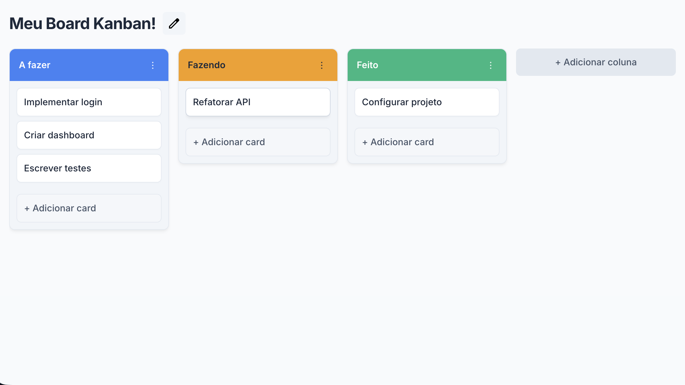

# Django Kanban



Um projeto de kanban board construído com **Django**, explorando duas abordagens de frontend em paralelo:

1. **Django Templates** — renderização server-side tradicional
2. **Web Components (Lit)** — custom elements carregados via bundle ESM, servidos como estáticos pelo Django

O objetivo central é comparar e integrar essas duas estratégias num mesmo projeto Django.

---

## Stack

| Camada | Tecnologia |
|---|---|
| Backend | Python 3.14 · Django 6 |
| Gerenciador de pacotes Python | [uv](https://github.com/astral-sh/uv) |
| Frontend (Web Components) | [Lit](https://lit.dev/) · TypeScript |
| Hipermídia / Interatividade | [HTMX](https://htmx.org/) · [Alpine.js](https://alpinejs.dev/) |
| Bundler | Vite (library mode) |
| Linter / Formatter (Python) | Ruff · pyupgrade |
| Linter / Formatter (TypeScript) | [Biome](https://biomejs.dev/) |
| Pre-commit hooks | uv-lock · ruff-check · ruff-format · pyupgrade |

---

## Estrutura do Projeto

```
django-kanban/
│
├── core/                          # Configurações do projeto Django
│   ├── settings.py
│   ├── urls.py
│   ├── asgi.py
│   └── wsgi.py
│
├── kanban/ 
│   ├── views.py
│   ├── templates/
│   │   ├── base.html
│   │   └── kanban/
│   │       ├── templates/*.html   # Abordagem Django Templates
│   │       └── components/*.html  # Abordagem Web Components (Lit)
│   ├── static/
│   │   └── kanban/
│   │       ├── css/
│   │       └── js/                # ← bundle gerado pelo Vite
│   ├── urls.py
│   ├── models.py
│   ├── apps.py
│   └── migrations/
│
├── frontend/                      # Código-fonte dos Web Components
│   ├── index.ts
│   └── components/
│       └── kanban-*.ts
│
├── package.json
├── tsconfig.json
├── vite.config.ts
├── pyproject.toml
├── .pre-commit-config.yaml
└── manage.py
```

### Rotas disponíveis

| URL | View Class | Métodos | Descrição |
|---|---|---|---|
| `/templates/` | `index` | GET | Página renderizada com Django Templates |
| `/components/` | `index` | GET | Página com Web Components (Lit) |
| `/card/` | `CardCreateView` | POST | Criação de novo card |
| `/card/<id>/` | `CardDetailView` | GET, PATCH, DELETE | Visualização, atualização (movimentação/título) e deleção de card |
| `/column/` | `ColumnCreateView` | POST | Criação de nova coluna |
| `/column/<id>/` | `ColumnDetailView` | GET, PATCH, DELETE | Visualização, atualização (movimentação/detalhes) e deleção de coluna |
| `/board/<id>/` | `BoardDetailView` | GET, PATCH | Visualização e edição do título do quadro |
| `/admin/` | Django Admin | - | Painel de administração |

---

## Setup

### Pré-requisitos

- Python 3.14+
- [uv](https://docs.astral.sh/uv/getting-started/installation/)
- Node.js 20+ e npm

### Instalação

```bash
# 1. Clonar o repositório
git clone <repo-url>
git checkout main
cd django-kanban

# 2. Criar o ambiente virtual e instalar dependências Python
uv sync

# 3. Instalar dependências Node
npm install

# 4. Aplicar migrações
uv run manage.py migrate

# 5. Carregar os dados iniciais (fixture)
uv run manage.py loaddata initial_data
```

---

## Desenvolvimento

### Backend (Django)

```bash
uv run manage.py runserver
```

### Frontend (Web Components)

```bash
# Watch mode: rebuilda automaticamente ao salvar arquivos em frontend/
npm run dev

# Build único (produção)
npm run build

# Checar tipos TypeScript sem buildar
npm run typecheck

# Lint + verificar formatação (Biome)
npm run lint

# Lint + auto-fix (safe fixes)
npm run lint:fix
```

O Vite compila `frontend/` e gera o bundle em `kanban/static/kanban/js/kanban-elements.js`, além de copiar as bibliotecas externas (`htmx.min.js` e `alpine.min.js`) para a mesma pasta.

### Testes

O projeto possui testes unitários (models/views) e testes de integração de ponta a ponta (E2E) usando Playwright.

#### 1. Instalar os navegadores do Playwright (necessário apenas uma vez):
```bash
uv run playwright install chromium
```

#### 2. Executar testes unitários (rápidos, deseleciona integração por padrão):
```bash
uv run pytest
```

#### 3. Executar testes de integração (browser real rodando E2E):
```bash
# Execução headless (em segundo plano)
uv run pytest -m integration

# Execução headed (abrindo janela visual do navegador) com 1 segundo de intervalo para assistir
uv run pytest -m integration --headed --slowmo 1000
```

---

## Pre-commit Hooks

```bash
# Instalar os hooks (primeira vez)
uv run pre-commit install

# Rodar manualmente
uv run pre-commit run --all-files
```

Hooks configurados: `uv-lock` (lockfile atualizado), `ruff-check --fix`, `ruff-format`, `pyupgrade --py314-plus`.
